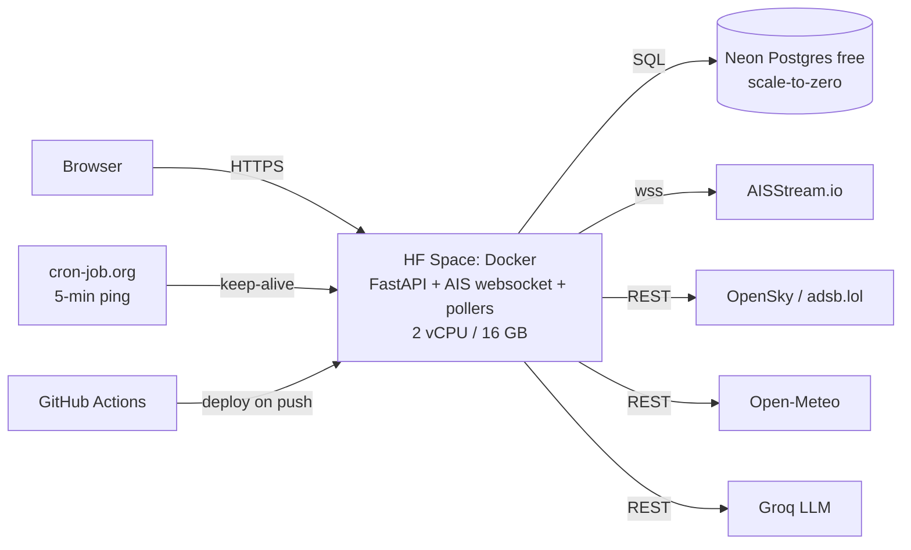

# NexaFreight v3 — Project Blueprint & Recovery Plan

**Version:** 3.0 · **Date:** 2026-08-26 · **Status:** Proposed direction (awaiting your sign-off)
**Scope:** Honest audit of the current repo → target product definition → architecture → data strategy → AI/ML & OR model portfolio → dashboard specs → failure-mode analysis → phased build plan.

---

## Table of Contents

0. Executive Verdict — Adjust or Rebuild?
1. Honest Audit of the Current Repository
2. Product Definition — What We Are Actually Building
3. The Data Honesty Principle (the #1 credibility rule)
4. Data Strategy — Real Feeds, Real Order Backbone (DataCo), Calibrated Execution Layer
5. Domain Model & Database Schema
6. Live Tracking & Map Layer (routes per mode, animation, congestion)
7. AI/ML Model Portfolio (what to build, what NOT to build)
8. Operations Research & Decision Engine (rerouting, modal shift, SLA-vs-profit)
9. SOP Rule Engine, Alerts & Human-in-the-Loop Approvals
10. Financial & ESG/Environmental Layer
11. Dashboard Specifications (every screen)
12. Failure-Mode Analysis — where this project gets killed in a pitch
13. Phased Build Plan with Acceptance Criteria
14. What to Keep / Fix / Delete from the Current Repo
15. Assumptions I Made & Decisions I Need From You
16. Free Cloud Deployment Architecture ($0/month)
17. Timeline, Effort & What I Need From You
18. Sources

---

## 0. Executive Verdict — Adjust or Rebuild?

**Verdict: Keep the technology shell. Rebuild the core. Do not rewrite the frontend framework.**

Concretely:

| Layer | Verdict | Why |
|---|---|---|
| FastAPI + PostgreSQL + Docker stack | **KEEP** | Right tools, industry-standard, already containerized |
| Leaflet + Chart.js frontend (vanilla JS) | **KEEP & RESTRUCTURE** | 3,500 lines of UI exist; a React migration adds 3+ weeks of zero user-visible value. Restructure into modules later if needed |
| JWT auth approach | **FIX** | Hand-rolled single hardcoded user → real users table, bcrypt, roles, approval limits |
| Open-Meteo weather integration | **KEEP** | It's real, free, keyless — one of the few genuinely live pieces |
| OpenSky flights integration | **KEEP & HARDEN** | Real, but no credit management, no caching, fake fallback data on failure |
| "AIS telemetry" (ais_receiver.py) | **REBUILD** | It is fake — the stream function does nothing, 4 hardcoded ships never move, status endpoint reports "online" |
| DataCo dataset as the operational core | **REPURPOSE** (revised after your feedback) | Its **order/demand backbone is real and stays** (products, dates, geography, margins); its logistics fields (retail parcel classes, 0–6-day lead times, derived late-risk) cannot support freight and get replaced by the calibrated execution layer (§4.3) |
| XGBoost ETA model | **REBUILD** | Trained on quasi-discrete targets with leakage; `/api/shipments` doesn't even use it (hardcoded risk constants) |
| "Operations research" module | **REBUILD** | Contains zero optimization — it is pandas arithmetic with made-up density factors |
| SOP engine / AI copilot | **REBUILD** | Canned hardcoded strings + a Groq call; no rule engine, no alerting, no approvals |
| Demurrage calculation | **REBUILD** | Computed from *promised shipping days* — demurrage actually accrues from container dwell at destination after free time. Any logistics person kills this in 30 seconds |
| Six Sigma / SPC | **DEMOTE** | Your instinct is right — it stays as one analytics card (control charts on lane lead times), not a headline feature |

**The one-sentence diagnosis:** the current app is a *static analytics report over a 2015–2018 retail CSV, dressed up to look like a live operations product*. Your vision is a *live operations product*. No amount of patching bridges that gap — the data model (orders-as-rows) cannot represent shipments, legs, vessels, events, or decisions. But the scaffolding (FastAPI, Docker, Leaflet UI, weather, OpenSky) is worth keeping, so this is a **core rebuild inside a kept shell**, not a from-scratch rewrite.

**Expected effort:** ~6–8 weeks of focused work following the phased plan in §13. Each phase ends with something demoable, so you always have a working artifact — no more two-week fix loops.

---

## 1. Honest Audit of the Current Repository

What actually exists (as committed at `1bb3914`):

| Component | File(s) | Reality check |
|---|---|---|
| API monolith | `backend/app.py` (1,153 lines) | 23 endpoints, single file, SQL string-built, no service layer |
| Auth | `app.py` login | ONE hardcoded user (`manager@nexafreight.com` / `SmartTrack2025`), credentials printed in README and pre-filled in the login form |
| Live ships | `telemetry/ais_receiver.py` | `start_ais_background_stream()` sets a flag and **returns None**. 4 hardcoded vessels (Ever Given "parked" at fixed coordinates forever). `/api/ais/status` reports `"stream_connected": true` — it reports a connection that does not exist |
| Live flights | `/api/telemetry/live` | OpenSky call is real; on failure silently substitutes 2 hardcoded flights; no rate-limit/credit handling (anonymous = 400 credits/day; a demo will burn this) |
| Trucks | `/api/telemetry/live` | 2 hardcoded trucks, never move |
| ML risk scores | `/api/shipments` | **The XGBoost model is never used here.** `delay_risk_pct` = hardcoded constants per mode (0.874, 0.798, 0.479, 0.398). Every "First Class" row shows 87.4% forever |
| ML predict | `/api/predict` | Does run the model, but the 47-feature vector includes `Simulated_Flight_Delay_Hrs` etc. — the "telemetry" features are simulated noise baked into training |
| Demurrage | `app.py`, `operations_research.py` | `(scheduled_days − 4) × $300` where `days_for_shipment_scheduled` is the *promised lead time* in DataCo — i.e., an order promised slower shipping "accrues demurrage." Inverted logic |
| Six Sigma | `/api/kpis`, `/api/spc` | DPMO computed from static 2015–18 data; `sigma_level` is a hardcoded `1.60` |
| AI copilot | `telemetry/sop_engine.py` | Groq LLM call + hardcoded fallback strings (the "+$850 net benefit" is a string literal, not a computation) |
| Data pipeline | `dataco_pipeline.py` | Hardcoded Windows paths (`D:\smart_track\...`); imports `backend.telemetry.telemetry_engine` — **a module that does not exist in the repo**. The repo cannot regenerate its own database |
| Training | `train_eta_regressor.py` | Requires CUDA; trained on DataCo where `Days for shipping (real)` is a near-discrete 0–6 value and `Late_delivery_risk` is derivable from dropped leakage columns |
| DB setup | `database_setup.py` | Hardcoded creds (`admin321`), Windows paths |
| Secrets hygiene | multiple | JWT default secret, DB password, and a **college proxy IP with credentials** (`edcguest@172.31.100.27:3128`) hardcoded in two files |
| Tests | `backend/test_*.py` | Not tests — scripts that hit production URLs and print |
| Artifacts | `backend/models/*.pkl` | 14 MB pickled model committed to git |
| Frontend | `portal/` (3,500 lines) | Actually decent: Leaflet map, Chart.js panels, login flow, tables. But map corridors are hardcoded decorative polylines; "OpenSky: 109 Flights" chip is a hardcoded label |

**Why you've been stuck in fix-loops:** every feature is downstream of a data model (flat DataCo rows + in-memory fake telemetry) that cannot support the feature. Fixing the symptom (a chart, an endpoint) never fixes the cause (no shipment/leg/event model, no real telemetry layer). The blueprint below fixes the foundation first, which is what makes it fail-proof going forward.

---

## 2. Product Definition — What We Are Actually Building

**NexaFreight Control Tower** — a web platform for a fictional-but-realistic industrial shipper/freight-forwarder ("NexaFreight Industries") where operations staff:

1. **Log in with role-based accounts** (Operator / Logistics Manager / Finance / Director — each with different approval authority).
2. **Monitor live multi-modal shipments** (ocean, air, road) on a real map with real vehicle positions, real weather, real port congestion — carrying **real cargo (DataCo's 180K orders)** bound to real vehicles.
3. **See money tick in real time**: demurrage clocks at ports, detention, SLA penalty exposure, expedite spend vs budget.
4. **Receive alerts when SOP rules fire** (delay risk, demurrage thresholds, SLA breach proximity, carbon budget, HOS violations…) — each alert carries an **AI-recommended decision with the full cost math**, which a **human approves, rejects, or modifies** with an audit trail. AI never executes alone.
5. **Use OR to decide**: when a disruption hits — accept the delay or reroute? Which route? Which shipments on this vessel should shift to air? The decision engine enumerates options, prices each one, and ranks by expected total cost subject to SLA constraints.
6. **Plan with forecasting**: demand forecast → capacity pre-booking → freight budget projection; lane-level analytics and carrier scorecards.
7. **Track environmental compliance**: GLEC-aligned CO₂e per shipment, IMO CII vessel grades, internal carbon price in every decision, carbon budgets with alerts.

**Personas:**
- **Operator (control tower)** — watches the map + alert queue, executes first-response actions, approves ≤ $1k decisions.
- **Logistics Manager** — approves ≤ $25k (reroutes, modal shifts), tunes rules, reviews carrier scorecards.
- **Finance** — budgets, exposure, penalty burn, invoice reconciliation view.
- **Director** — executive analytics, ESG, quarterly reviews.

**Non-goals (explicitly out of scope):** payment processing, customs filing, warehouse management, carrier tendering marketplaces, autonomous AI execution.

### 2.1 Course syllabus → product feature coverage map

Your B.Tech NEP curriculum (MNNIT, Production & Industrial Engineering, 2022–23) — relevant courses from the scheme of instruction, mapped to where each lives in the product. *(Provisional at unit level: the PDF parser reads the first ~30 pages, which cover the full course structure but not the detailed units of the Sem III–VII courses below — unit-level refinement when you share those pages.)*

| Course (Sem) | Core units (standard) | Where it appears in NexaFreight |
|---|---|---|
| **Operations Research** — PIN13103 (III) | Linear programming & simplex, duality, transportation & assignment problems, queueing theory, inventory (EOQ/ROP), PERT/CPM, simulation, dynamic programming | LP → mode-mix optimizer & modal-shift breakeven curves (§8.3); transportation problem → lane↔carrier allocation; assignment → truck-driver scheduling; **queueing → port congestion model** (anchorage arrival/service rates, §6.3); EOQ/ROP → safety-stock alert rules & capacity pre-booking; **PERT → ETA P10–P95 from milestone variance** (§7.1); Monte Carlo → exposure simulation; DP → sequential hold/reroute decision stages (§8.1) |
| **Production & Operations Management** — HSN14601 (IV) | Forecasting, capacity planning, scheduling, MRP, lean/JIT, inventory, quality | Demand forecasting module with rolling backtests (§7.1 #4); capacity pre-booking; OTIF & lead-time analytics (§11.4); SPC card; freight budgets (§10.1) |
| **Metrology & Quality Engineering** — PIN14105 (IV) | SPC control charts, process capability, sampling plans, Six Sigma | X̄-R control charts on lane lead times; **Cpk on SLA adherence**; ETA-model calibration page (measurement-system thinking); acceptance-sampling logic for carrier data-quality flags (§7.3) |
| **Management Concepts** — PIN14104 (IV) + **Business Economics** — HSS17602 (VII) | Cost analysis, break-even, investment appraisal, pricing | Financial cost ledger & exposure dashboards (§10.1); **expedite break-even penalty curves** (§8.3); rate cards & surcharges |
| **Industry 4.0 & IoT** — PIN15103 (V) | Sensors, industrial data pipelines, digital twin, cyber-physical systems | AIS/ADS-B WebSocket ingestion = a real IIoT pipeline; **sensor threshold rules from your SOP Worksheet 3** (cold-chain 2–8°C, wave height, SOG — §9.4); live map + ghost binding = operational digital twin |
| **Supply Chain Management** — PIN17101 (VII) | Demand & supply planning, inventory, bullwhip effect, network design, risk management, sustainability | Demand module; safety stock; **reroute/network options (§8)**; disruption library from real event data (§4.5); GLEC CO₂e + IMO CII + carbon budgets (§10.2); carrier scorecards (variability/bullwhip analytics) |
| **Basic Industrial Engineering** — MEN14204 | Work study, productivity, costing | Port dwell & terminal operations analytics; productivity KPIs (OTIF, cost/unit) |
| Intro to AI & ML — CSN12601 (II) | ML fundamentals | The entire §7 model portfolio |

Every row is demonstrable in the UI — this table doubles as your **viva/pitch slide**: "my coursework, operationalized."

---

## 3. The Data Honesty Principle

This is the single most important design rule, and it's what makes the product pitchable to a real industry audience:

> **Every number on every screen carries a provenance label: `REAL`, `DERIVED`, `CALIBRATED`, or `PROJECTED`.**

| Label | Meaning | Examples |
|---|---|---|
| `REAL` | Straight from a live external feed | Vessel position (AIS), aircraft position (OpenSky), weather (Open-Meteo) |
| `DERIVED` | Computed from real data by us | Port congestion index (from AIS anchorage counts), great-circle distance, lane transit stats |
| `CALIBRATED` | Constructed by us, with **every parameter citing a published source** (fixed seeds, reproducible) | Execution events/dwell, rate cards & tariffs from public ranges, our truck fleet, cargo-to-vessel bindings |
| `PROJECTED` | Model output | ETA P50/P85, delay risk %, demand forecast, cost projections |

Why: no startup or student team gets real cargo-level tracking data — **and industry people know that.** What kills credibility is pretending; what builds credibility is a clean, explicit data architecture that shows you *could* plug real data in (and where). "Real vessels + real orders, constructed binding, labeled" is a defensible, professional demo posture. The current code's fake `stream_connected: true` is the exact opposite and would end the meeting.

---

## 4. Data Strategy

### 4.1 Live external feeds (all free-tier viable)

| Feed | Source | Access | Limits / notes | Use |
|---|---|---|---|---|
| **Ships (AIS)** | [AISStream.io](https://aisstream.io) | WebSocket `wss://stream.aisstream.io/v0/stream`, free API key (GitHub login) | Free, no paid tier; terrestrial coverage gaps; subscribe by bounding box to control volume | Live vessel positions, port congestion (anchorage counts) |
| **Flights (ADS-B)** | [OpenSky Network](https://openskynetwork.github.io/opensky-api/rest.html) | REST; anonymous 400 credits/day, free registered account 4,000/day | Small bbox (≤25 deg²) = 1 credit; poll 60–120s per corridor | Live aircraft positions; filter to freighter callsigns (GTI/CLX/BOX/CKS…) for cargo realism |
| **Flights fallback** | adsb.lol / airplanes.live community APIs | REST, free | Volunteer-run; good redundancy when OpenSky 429s | Same |
| **Trucks** | None exists publicly (ELD/telematics is proprietary) | — | — | **Our own fleet on real road geometry** (OSRM routes) with traffic-adjusted speeds/HOS. Label `CALIBRATED` |
| **Road geometry** | OSRM (public demo server for dev; self-host in Docker for reliability) | REST, returns real road-following polyline | Demo server rate-limited — cache route geometry per lane | Truck route rendering + km calculations |
| **Ocean route geometry** | **Eurostat SeaRoute** (⚠️ Java library + CLI, EUPL license) → run **once offline** over our fixed port-pair list → commit lane GeoJSON; or the **Python `searoute` PyPI package** if we need routes computed at runtime; CIA shipping-lanes GeoJSON as a visual base layer | Free/open | Precompute once per port-pair, cache in DB/GeoJSON files | Realistic curved shipping lanes (ships don't sail straight lines) |
| **Weather** | Open-Meteo (current + forecast + marine) | REST, keyless, free | Generous limits | Port/vessel weather, disruption injection realism |
| **Ports/airports** | UN/LOCODE, World Port Index, Our Airports | Free datasets | Static | Master data |

**Cost: $0.** All free tiers, no credit card. This was verified Aug 2026.

### 4.2 The "ghost binding" pattern (your idea — and it's the right one)

You can't get real cargo telemetry → so **overlay our real cargo (DataCo orders) onto real vehicles**:

1. We maintain our own shipment plans (cargo, ports, dates) in our DB.
2. The **Binding Service** matches each ocean leg to a real vessel observed in AIS: same lane direction, container-appropriate vessel class, plausible ETA window. We "book" our container on that vessel's trajectory.
3. While bound: the shipment marker shows the **real vessel's live position** (`REAL`); our containers derive from real order lines. The UI shows: *"Vessel: EVER GIFT (IMO 9893848) — live AIS · Manifest: our real orders, binding constructed."*
4. If binding is lost (coverage gap), we **dead-reckon** along the cached searoute lane at last observed speed, labeled `DERIVED (est.)`, until AIS reacquires.
5. Same pattern for air: bind to real freighter flights on the corridor; label clearly.
6. Trucks: our own fleet (the one structurally private asset a shipper always has) moving on real OSRM road geometry with traffic-adjusted speeds — labeled `CALIBRATED`.

This gives you a live map that is *mostly real*, with synthetic business meaning on top — exactly how professional demos (and many real visibility products) bootstrap.

### 4.3 The company data layer — real-data-first (no invented orders, no invented products)

**Revised after your feedback: you are against synthetic data — so DataCo becomes the real backbone.** The layer that replaces the old "simulator" is built like this:

**Tier 1 — REAL (used as-is):**
- **DataCo's 180,519 order lines (2015–2018)** = our company's real order history: products & categories with prices, order timestamps (real seasonality), customer segments, markets, order geographies (164 countries / ~3.6K cities), sales, discounts, and **order margins including genuinely loss-making orders** — which is exactly what the financial/SLA model needs to reason about "air at a loss vs ocean at a profit."
- Live feeds: AIS vessels, ADS-B flights, Open-Meteo weather (§4.1).
- IMF PortWatch chokepoint daily transits & trade volumes (2019–2024) — real congestion/seasonality.
- Port Disruption DB — real disruption durations/severities.
- Reference data: ports (UN/LOCODE/WPI), airports (Our Airports), maritime network (Eurostat searoute).

**Tier 2 — CALIBRATED DERIVED (constructed, but every parameter cites a real source, all labeled, all reproducible):**
- **Order → shipment planning rules**: each order line is grouped into shipments and mapped to an origin facility and freight mode by deterministic, documented rules (e.g., Same Day → road courier; First Class → air; Second Class → road FTL/LTL; Standard Class → ocean/rail multi-leg). No randomness.
- **Execution layer** (the part that is *structurally* private — see §4.6): dwell time distributions per port calibrated from Port Disruption DB + IMF chokepoint data; transit speeds from lane statistics; rate cards/tariff tiers from public ranges; disruption injection probabilities from the real event databases. Fixed seeds → reproducible demos.
- **Ghost binding** (§4.2): ocean/air legs ride on **real live vessels/flights** observed in AIS/ADS-B.

Every number keeps its provenance chip: `REAL`, `DERIVED`, `CALIBRATED`, `PROJECTED`. And the schema is built so a real company's TMS/EDI feed (booking + milestone events) replaces Tier 2 one-for-one — that's the pitch: "the model layer is calibrated on published research data and real feeds; plug in your EDI and it's production."

### 4.4 What happens to DataCo (revised)

**Repurposed, not retired.** We keep its order/demand backbone (products, dates, geography, customers, financials) as real data — this also means **demand forecasting (§7) trains on real 2015–2018 order history, not synthetic series**. We drop or rebuild only its logistics fields, because they cannot support freight reality:
- `Shipping Mode` (retail parcel classes: Standard/Second/First Class, Same Day) → remapped to freight modes by documented rules
- `Days for shipping (real)` (near-discrete 0–6 days, nearly determined by parcel class) → replaced by our event-based transit model
- `Late_delivery_risk` / `Delivery Status` (derived → leakage) → never used as features; breach risk comes from our ETA quantile model
- No cargo weight/volume anywhere in the file → mass computed from product/category tables with **cited** density references (the old code invented them silently)

### 4.6 Why the execution layer must be constructed (the honest physics)

No public dataset on Earth contains company-level freight execution — which company's containers were on which vessel, their free-time clocks, demurrage accruals, SLA clauses, customs events. That data lives in private TMS/EDI systems (and is precisely what project44/FourKites charge enterprises to integrate). So any realistic product demo faces the same fork: (a) invent it silently (what v2 did — indefensible), or (b) construct it **explicitly, calibrated on published research data, bound to real vehicles, fully labeled** — and design the pipeline so a real EDI feed drops in later. We do (b). This is also exactly the idea you proposed at the start: *attach our cargo to real ships/flights* — DataCo is now "our cargo," real.

### 4.5 Audit of the three datasets currently in use (verified 2026-08-26)

| Dataset | What it actually is (verified) | Verdict | Role in v3 |
|---|---|---|---|
| **DataCo SMART Supply Chain** (Mendeley, DOI 10.17632/8gx2fvg2k6.5; [Kaggle mirror](https://www.kaggle.com/datasets/shashwatwork/dataco-smart-supply-chain-for-big-data-analysis)) | 180,519 order-line rows from a fictional sporting-goods **e-commerce** company, 2015–2018 (CC BY 4.0). Real order/demand backbone: products, dates, geography, segments, margins. Its *logistics* fields are retail parcel classes with near-discrete 0–6-day lead times and a derived late-risk column (leakage); **no weight/volume/containers/carriers/ports/events at all** | 🔁 **Repurpose (revised after your feedback)** | **Real order & demand backbone** (§4.3 Tier 1): shipments are built from real order lines; demand forecasting trains on real 2015–18 seasonality; loss-making orders feed the financial model. Its logistics fields are replaced by the calibrated execution layer. Evidence from our own trained artifact: top model features were `Shipping Mode` (0.42), scheduled days (0.15), a leakage column (0.15), and invented `Simulated_*` noise (0.15) |
| **Global Daily Port Activity & Trade Estimates** (Kaggle — IMF PortWatch-derived) | Daily transit calls **+ trade tonnage estimates for 24 global maritime chokepoints** (Suez, Malacca, Panama, Hormuz, Dover…), 2019-01-01 → 2024-10-26, ~3.5M rows / 541 MB CSV; World Bank dataset terms | ✅ **Keep — genuinely excellent and underused** | (a) Realism anchors: chokepoint seasonality/volumes calibrate lane parameters; (b) it **contains the real signatures of famous disruptions** — Suez/Ever Given (Mar 2021), COVID waves, Red Sea collapse (2024) → our disruption library and analytics showpieces; (c) a baseline to validate our own AIS-derived chokepoint counts. Keep ~MB-sized aggregates in repo, raw CSV out of git |
| **Port Disruption Database** (Verschuur et al., GitHub) | Peer-reviewed dataset (paper in *Transportation Research Part D*): event × port records of **natural-hazard-induced port disruptions 2011–2019** — days of reduction/shutdown/recovery, total affected days, severity class (1: 0–40%, 2: 40–80%, 3: 80–100% operational impact), **plus per-event daily vessel-activity time series per port** (affected *and* unaffected control ports) | ✅ **Keep — high value** | (a) Calibrates the simulator's disruption injection with real duration/severity distributions; (b) port resilience profiles for analytics; (c) validation reference for our congestion-detection algorithm. Gaps: natural hazards only, last update Jan 2020, no explicit license → cite the paper, don't redistribute raw |
| **— recommended supplement** | Hand-curated ~30–50 **non-natural** events (Ever Given 2021, LA/LB COVID congestion 2021, Panama Canal drought 2023–24, Red Sea crisis 2024, Baltimore Key Bridge 2024, port strikes) cross-checked against the chokepoint dataset's signatures | ➕ **Add** | Broadens the disruption taxonomy to the events executives actually remember — and every entry can cite public reporting |
| **Maritime Port Performance dataset** (your Drive folder — UNCTAD port-performance indicators) | Country × vessel-type statistics: **median time in port (days)**, average vessel age, average/max GT, dwt, TEU capacity, by half-year (2022-S1+). E.g., world container ships: 0.84 d median port time; dry bulk: 2.23 d | ✅ **Keep — direct calibration source** | **Port-dwell priors per country & vessel type** for the dwell model (§7.1 #3) and the demurrage engine's expected-dwell parameter — real published statistics instead of guesses; plus vessel-size realism for fleet profiles |

**Net:** your data instinct was right — **2 of the 3 are keepers** (the chokepoint dataset is a real find; few student projects use it). DataCo is the one to drop, and it's the one currently carrying the whole app.

**searoute note (you found `eurostat/searoute`):** good find — it's already in the plan, with one catch verified: the Eurostat repo is a **Java** library/CLI (Maven), not Python. Two clean ways to use it, both free: (1) run the CLI **once offline** over our port-pair list → commit the resulting lane GeoJSON (zero runtime deps — recommended for our fixed lane set); (2) the **Python `searoute` PyPI package** if we later need dynamic routing at runtime. We can also drop the Eurostat network GeoPackage (5–100 km resolutions) as our base maritime graph.

---

## 5. Domain Model & Database Schema (core tables)

The current repo has **one table** (`shipments` = flat DataCo rows). The new core (PostgreSQL, Alembic migrations):

```
── Master data (SIMULATED) ───────────────────────────────
users(id, email, password_hash, name, role, approval_limit_usd, status)
customers(id, name, tier[A|B|C], sla_hours, penalty_pct, churn_ltv_usd, region)
skus(id, code, name, category, unit_weight_kg, unit_volume_m3, unit_value_usd,
     hazmat_class, temp_controlled)
carriers(id, code, name, modes[], reliability_pct, on_time_pct)
ports(id, locode, name, lat, lon, anchorage_geojson, free_time_days, tariff_json)
airports(id, iata, name, lat, lon)
lanes(id, origin_type, origin_id, dest_type, dest_id, mode[OCEAN|AIR|ROAD|RAIL],
      distance_km, route_geojson, base_transit_hrs)
rate_cards(id, lane_id, carrier_id, price_base, price_unit, surcharges_json, valid_daterange)

── Operational entities ──────────────────────────────────
shipments(id, ref, customer_id, origin_facility, dest_facility, incoterm,
          status[PLANNED|BOOKED|IN_TRANSIT|AT_PORT|CUSTOMS|DELIVERED|EXCEPTION],
          value_usd, weight_kg, volume_m3, sla_due_at, co2_kg_actual, created_at)
shipment_lines(id, shipment_id, sku_id, qty, line_value_usd)
legs(id, shipment_id, seq, mode, lane_id, carrier_id, status,
     planned_dep/arr, actual_dep/arr,                          -- each may be revised by decisions
     bound_entity_type[vessel|aircraft|truck], bound_entity_id)
containers(id, leg_id, container_no, size_teuf, discharged_at, free_time_until,
           last_free_day, gate_out_at)                          -- drives the demurrage clock

── Event sourcing & telemetry (append-only) ──────────────
events(id, entity_type, entity_id, event_type, ts, payload_json,
       provenance[REAL|DERIVED|CALIBRATED|PROJECTED])
positions(id, entity_type, entity_id, ts, lat, lon, speed, heading, provenance, raw_ref)
vessels(mmsi PK, name, imo, type_class, length_m, latest_position_id, last_seen_at)
aircraft(icao24 PK, callsign, country, operator_type[freighter|pax], latest_position_id, last_seen_at)
trucks(id, plate, driver_id, hos_state_json, current_leg_id)

── Intelligence & governance ─────────────────────────────
sop_rules(id, code, version, category, condition_json, severity, action_template,
          authority_role, effective_from, effective_to, reference_doc)
alerts(id, shipment_id, rule_id, severity[INFO|WARN|CRITICAL],
       status[OPEN|ACK|PENDING_APPROVAL|DECIDED|EXECUTED|RESOLVED|EXPIRED],
       detected_at, context_json)
decision_options(id, alert_id, option_type[HOLD|REROUTE_PORT|TRANSSHIP|MODAL_SHIFT_AIR
       |SPLIT_SHIPMENT|EXPEDITE_GATEOUT|...],
       eta_p50_hrs, eta_p85_hrs, p_on_time, cost_breakdown_json, co2_delta_kg,
       expected_total_cost_usd, feasible, requires_role)
decisions(id, alert_id, option_id nullable, action[APPROVED|REJECTED|MODIFIED],
          decided_by, decided_at, reason_code, override_note, outcome_json)
budgets(id, period, category[FREIGHT|EXPEDITE|DEMURRAGE|PENALTIES|CARBON], limit_usd)
forecast_runs(id, model, target, trained_at, backtest_json)
forecast_values(run_id, key, horizon_date, q10, q50, q90)
```

Key design decisions:

- **Event-sourced operations**: every state change is an immutable event. This powers timelines, audit, replay (record real AIS/OpenSky snapshots during dev → replay offline for deterministic testing), and model training data.
- **Legs are separate from shipments** — a shipment JFK→Rotterdam→plant is 2+ legs with different modes; rerouting revises legs, and the decision is recorded.
- **Containers carry the demurrage clock** — free time, last free day, per-diem tier from the port tariff table. Demurrage becomes *computed from dwell events*, not a formula on promised days.
- **Roles carry approval limits** — enforces the human-authority matrix.

---

## 6. Live Tracking & Map Layer

### 6.1 How each mode's route is drawn (your question: "flights are straight, ships/trucks aren't")

| Mode | Geometry | Library / method | Cached |
|---|---|---|---|
| **Air** | Great-circle arc (geodesic) between airports — naturally curved on a 2D map | `leaflet-geodesic` or manual slerp interpolation (also honest: flights follow ATC routings, but great-circle is the accepted simplification — we label it "planned geodesic") | per lane |
| **Ocean** | Real maritime path: shortest path over a global sea network, hugging lanes, avoiding land | `searoute` Python package → GeoJSON → stored on `lanes.route_geojson`; render polyline | per port-pair, once |
| **Road** | Real road-following polyline | OSRM `/route` → polyline → cached | per lane, once |

The marker then moves **along the cached geometry** by progress fraction (`REAL` position if bound; interpolated otherwise). No more straight lines across Africa.

### 6.2 Map UX — "maximum optimal data, minimum clutter"

Progressive disclosure (this is how real control towers do it):

- **Zoomed out:** lanes as thin colored polylines per mode (ocean=blue, air=violet dashed, road=amber), vehicle markers with mode icon + status halo (green/amber/red by delay risk). Click a lane → shipment list for that lane.
- **Hover marker:** compact card — shipment ref, cargo summary, ETA P50 (P85), delay risk %, demurrage accruing (if at port), current leg + next milestone, provenance chips (🛰️ REAL / 📦 SIM).
- **Click marker:** right drawer — full milestone timeline (17track-style), documents, cost breakdown to date, CO₂e, decision history, live weather at current position, and "Simulate disruption" (demo button).
- **Side panels (not on the map):** weather-at-ports strip, congestion indices, disruption feed, alert count. The map never becomes a dashboard.
- **Rendering tech:** stay on Leaflet + `leaflet-canvas-markers` (canvas rendering handles hundreds of markers); only move to MapLibre/deck.gl if we exceed ~2k live markers (we won't at demo scale).

### 6.3 Derived intelligence on the map

- **Port congestion index (our own, `DERIVED`):** count of vessels with speed <1 kt inside each port's anchorage polygon from our AIS store, 7-day rolling baseline → "Rotterdam: 62 vessels at anchor, +38% vs baseline, expect +1.8d dwell." This is a genuinely real technique (it's how commercial port-congestion products work) and it uses only free AIS data.
- **Weather overlay:** wind/precip icons at ports; storm polygons from Open-Meteo marine when severe.
- **Disruption feed:** rule-detected events (congestion spike, vessel loitering mid-route, flight canceled) + weather warnings.

---

## 7. AI/ML Model Portfolio

### 7.1 What we build

| # | Problem | Model | Why this choice | Output |
|---|---|---|---|---|
| 1 | **Door-to-door / leg ETA** | **LightGBM quantile regression** (P10/P50/P85/P95) on lane, carrier, distance, day-of-week, seasonality, port congestion index, weather, vessel class | Tabular, moderate data, heterogeneity; quantiles give *calibrated uncertainty* which is what SLA decisions actually need | ETA hours + interval |
| 2 | **Delay risk %** | Derived from #1: P(SLA missed) = P(ETA_dist > due date) | No separate classifier — one model, one truth; avoids the classic inconsistency where ETA says fine but risk says 87% | calibrated probability |
| 3 | **Port dwell distribution** | Lognormal/Bayesian per port + LightGBM residual correction | Dwell is heavy-tailed; feeds demurrage expectation and gate-out urgency | dwell dist |
| 4 | **Demand forecasting** (your priority — agreed) | Seasonal-naive → ETS (statsmodels) → global LightGBM with lags/calendar/price covariates → **per-hierarchy best-by-backtest, with ensemble** | Baseline-first is the honest method; rolling-origin backtest with MASE/WRMSSE vs seasonal-naive proves skill | weekly qty by SKU×region with prediction intervals |
| 5 | **Reroute / modal-shift selection** | **Deterministic cost evaluation + MILP (PuLP + CBC, or OR-Tools CP-SAT)** | Decisions must be *auditable* — an optimizer's solution can be shown as math; an RL policy cannot | ranked option set |
| 6 | **Anomaly detection** | SOP rules + robust z-scores on event stream | Simple, explainable, catches feed outages too | alerts |
| 7 | **Explanation layer** | SHAP for #1; **LLM (Groq Llama-3.3) strictly as copilot/QA** over rulebook + live context (RAG over SOP docs + alert evidence) | LLM writes *why* in plain English and answers operator questions; it never computes money or decides | narrative |

### 7.2 What we deliberately do NOT build (and why)

- **No deep learning / transformers for ETA** — wrong data volume/shape; gradient boosting wins and is explainable.
- **No RL dispatching policy** — unverifiable, unauditable, un-pitchable for safety-critical ops.
- **No LLM making or approving decisions** — your instinct is exactly right and matches industry reality (regulators and customers demand human-in-the-loop). LLM = explain & assist.
- **Six Sigma/DMAIC as a headline** — keep SPC control charts (X-bar on lane lead times, Cpk on SLA adherence) as one analytics card. You were right to deprioritize it.

### 7.3 Validation & honesty standards (so you never get caught flat)

- **Time-based splits only** (rolling-origin), never random shuffles — eliminates the leakage class that plagues the current DataCo model.
- Report MAE **and** pinball loss at each quantile **and** a calibration curve (predicted P(late) vs actual), with a target of calibration error < 5 pts.
- Champion/challenger: every model must beat seasonal-naive / current-heuristic baseline to ship; results stored in `forecast_runs.backtest_json` and shown in the app (transparency itself becomes a pitch feature).
- Every PROJECTED number in the UI links to its model card (features, training window, backtest metrics).

### 7.4 How "AI" appears in the product narrative (for the pitch)

Three distinct AI roles, clearly separated — this framing survives expert scrutiny:
1. **Predict** (ML): ETA quantiles, delay risk, dwell, demand.
2. **Prescribe** (OR + rules): option generation & cost ranking per SOP policy.
3. **Explain & converse** (LLM): natural-language rationale grounded in the rulebook and the alert's evidence bundle — never free-floating.

---

## 8. Operations Research & Decision Engine

This is your centerpiece question — answering it precisely:

### 8.1 The disruption decision: "accept delay or reroute — and reroute where?"

When a disruption event hits a shipment (port congestion spike, storm, vessel breakdown, canal queue, flight cancellation, HOS break):

**Step 1 — Option generation** (deterministic enumeration, not ML):

| Option | Description |
|---|---|
| `HOLD` | Stay the course, accept predicted delay |
| `REROUTE_PORT` | Divert/discharge at alternate port (e.g., Rotterdam→Antwerp) + drayage to destination |
| `TRANSSHIP` | Unload at intermediate hub onto another vessel/service |
| `MODAL_SHIFT_AIR` | Air-freight the remaining distance (full or remainder-leg) |
| `SPLIT_SHIPMENT` | Air the urgent/high-value-density lines; the rest continues ocean (real ops do this constantly — it's the most "industry-literate" option) |
| `EXPEDITE_GATEOUT` | Already at port: priority customs/gate-out, dedicated drayage to beat last-free-day |

**Step 2 — Price every option** with a transparent cost stack:

```
ExpectedCost(o) = Δfreight(o)              -- from rate cards (mode, chargeable weight = max(actual, volumetric))
               + handling(o)               -- transshipment/re-handling fees
               + drayage(o)                -- alternate-port road legs
               + E[demurrage(o)]           -- expected dwell × tariff per-diem (from dwell model)
               + SLA_penalty × P(late|o)   -- penalty clause × probability from ETA quantiles
               + inventory_cost(o)         -- COGS × carrying rate × added days
               + ΔCO₂e(o) × carbon_price   -- internal carbon price (from our ESG policy)
               − revenue_protected(o)      -- avoided churn: P(churn|miss) × LTV (tier-based)
```

**Step 3 — Constrain by policy (SOPs as hard constraints):**
- Tier-A contractual shipments: must choose an option with **P(on-time) ≥ 0.9** even if it costs more (this is exactly your "SLA forces air even at a loss" scenario — formalized).
- Hazmat/temperature restrictions eliminate air for certain SKUs.
- Spend above the operator's authority auto-escalates the approval requirement.

**Step 4 — Optimize:**
- Single shipment: evaluate ≤ ~10 options, rank by expected cost → trivial compute, fully explainable table shown to operator.
- Multiple shipments sharing the disruption (one vessel, 40 of our containers, limited air capacity): **small MILP** — binary x[shipment, option], capacity constraints on expedite options, minimize total expected cost s.t. tier constraints. A few hundred variables; CBC (free, via PuLP) solves in milliseconds.

**Step 5 — Human decides.** The alert card shows the ranked options with full math; operator/manager approves, rejects, or modifies; decision + reason logged; outcome tracked (predicted vs actual) → feeds model improvement loop. **AI recommends, humans command — exactly as you specified.**

### 8.2 How we choose *which* alternate route (not just whether)

For `REROUTE_PORT`: candidate ports generated by graph proximity on our port network (within X nm of original discharge, with rail/road connection to destination), each priced as: vessel diversion time × charter equivalent + port tariff + drayage (OSRM distance × rate) + expected dwell difference + missed-connection risk. The shortest-distance option frequently loses to the one with lower congestion — the ranking table makes that visible (a very "real-ops" insight to demo).

For road legs/trucks: alternate routing = OSRM alternatives + live congestion penalty per segment (from our traffic model), with HOS-feasibility check (driver can legally complete the leg) — an HOS violation is *hard-infeasible*, not just costly.

### 8.3 The financial "always-in-profit" model — reframed honestly

Don't promise "always in profit" (nobody credible does). Promise — and compute — **expected-cost minimization subject to SLA constraints**, which is what real network-design does:

- Per order: `Contribution(m) = revenue − COGS − freight(m) − duties − E[penalty| m] − inventory(m)`, across modes m.
- The **breakeven penalty** where air beats ocean: `penalty_exposure* = (air_freight − ocean_freight) + Δinventory_cost`. Show this as a live curve in the financial dashboard — "for this lane, air becomes optimal when SLA exposure exceeds $X." Managers *love* this chart because it's a policy tool, not a black box.
- Churn-aware: for Tier-A customers, expected LTV loss compounds penalty → air triggers earlier.
- Mode-mix optimization per lane (which share of volume books ocean vs air vs road given demand forecast and SLA mix) = a monthly LP — this connects **forecasting → capacity pre-booking → budget**, the loop you asked for.

### 8.4 Why not ML for the routing decision itself?

Because the decision space is small and the cost model is transparent — optimization gives *provably best under assumptions* + auditability. ML would add opacity with no gain. (If asked in a pitch: "routing = constrained optimization; ML = uncertainty inputs to it." That sentence alone signals competence.)

---

## 9. SOP Rule Engine, Alerts & Human-in-the-Loop

### 9.1 SOPs as versioned data, not hardcoded strings

`sop_rules` table, each rule: `code, version, condition (JSON condition tree over shipment/event/alert features), severity, action template, authority role, reference doc`. Seeded examples (industry-standard, so they read as credible):

- `SOP-DEM-001` — container within 24h of last free day → WARN → "trigger priority gate-out / drayage to bonded CFS."
- `SOP-DEM-004` — projected dwell > 72h → evaluate REROUTE_PORT / feeder options.
- `SOP-SLA-002` — P(on-time) < 0.5 for Tier-A order → CRITICAL → evaluate MODAL_SHIFT_AIR; requires Manager.
- `SOP-SLA-003` — Tier-B/C: choose cheapest option ≥ P(on-time) 0.75 (this is the profit rule).
- `SOP-FIN-001` — total exposure > $25k → requires Director.
- `SOP-ENV-001` — shipment CO₂e > lane carbon budget → evaluate greener mode + approval.
- `SOP-CMP-001` — HOS breach imminent on road leg → mandatory rest hold (hard rule, non-overridable below Director).

Evaluated deterministically on the event stream (and on the clock, for time-based triggers like last-free-day). Rules have effective dates & versions → an **audit-grade trail**: "this decision was made under SOP-SLA-002 v3.1."

### 9.2 Alert lifecycle (the HITL loop you asked for)

```
DETECTED → TRIAGED (severity, dedupe)
        → RECOMMENDED (decision engine attaches ranked options w/ $ math)
        → PENDING_APPROVAL (routed to role with authority; SLA on deciding!)
        → DECIDED (APPROVED / REJECTED / MODIFIED — reason code mandatory)
        → EXECUTED (writes revised legs/events)
        → RESOLVED (outcome vs prediction recorded → learning loop)
```

UI: an **Alert Inbox** (like email, not a popup storm): severity chips, affected shipment, evidence bundle (chart of ETA distribution shift, congestion trend, weather), recommended option highlighted with alternatives, cost table, **Approve / Reject / Modify** buttons (Modify opens the option params — e.g., air only 2 of 5 lines), authority check, decision countdown ("decide within 4h to still make the air cutoff" — urgency realism). Every decision is queryable: "show me every modal shift approved this quarter and its realized saving" — that query *is* the pitch's ROI slide.

### 9.3 LLM copilot role (narrow, grounded)

Groq-hosted Llama-3.3 answers operator questions with **retrieval over**: SOP rulebook + this alert's evidence + shipment context + lane history. It can explain and suggest *which rule applies*, but the numbers always come from the engines. System-prompted to cite rule codes; if no rule applies, it says so instead of improvising (grounding + refusal = credibility).

### 9.4 Seed values from your team's Business SOP Research Guide (extracted from the Drive folder)

The `Business_SOP_Research_Guide_TeamMember4.pdf` (authored for "Apex Global Logistics & Freight Corp") gives us **team-authored, industry-referenced rulebook values** — the seed data for `sop_rules`, `rate_cards`, and the approval flow (superseding my placeholder numbers):

**Tariff & penalty matrix (Worksheet 2) → demurrage/rate-card seeds:**

| Mode / carrier tier | Free time | Penalty | SLA breach fine |
|---|---|---|---|
| Ocean dry (Maersk/MSC tier) | 5 days at port | $250/day/container | $1,000 flat |
| Ocean reefer (Maersk/MSC tier) | 2 days at port | $550/day/container | $2,500 + inspection |
| Air express (DHL/FedEx) | 24 h at hub | $1,200/day | $5,000 |
| Inland trucking/rail (intermodal) | 12 h at ramp | $150/hour | $500 flat |

**Financial escalation matrix (Worksheet 4) → `users.approval_limit_usd`:**
Level 1 Logistics Dispatcher ≤ **$2,500** (port priority alert, speed advisory, carrier alert) · Level 2 Supply Chain Manager ≤ **$25,000** (feeder-port reroute, partial air expedite) · Level 3 Regional Director ≤ **$100,000** (carrier contract override, full reshipment) · Level 4 VP Operations **unlimited** (insurance claim, contract termination, C-suite alert).

**IoT / environmental thresholds (Worksheet 3) → cargo-environment alert rules** (the second meaning of "environmental standards" — cargo environment, beyond CO₂):
- Vessel speed (SOG): normal 14–20 kn · warning 10–13.9 kn
- Sea wave height: normal 0.5–3.0 m · warning 3.1–4.9 m · critical ≥ 5.0 m (storm alert)
- Cold-chain pharma: normal 2–8 °C · warning 8.1–10 °C (>1 h) · critical >10 °C (>4 h = spoilage claim)
- Electronics humidity: normal 30–50% · warning 51–65% · critical >65% (condensation damage)

**SOP-LOG-001 seed (Worksheet 1):** trigger = ML late risk > 70% AND delay > 2.0 d AND cargo value > $50k → divert to secondary feeder port ($2,500 + $300/d) or partial air expedite of urgent lines (~$12,500); expected: recover 3–4 d, avoid ~$20k SLA penalty.

These values are **v0.1 draft seeds** — real-life SOP research is ongoing and the owner will refine them (that's by design: rules are versioned *data*, editable without touching engine code; see `AGENTS.md` §1.2–1.3). Where the old hardcoded code disagreed (e.g., flat $300/$450/$600 tiers), the guide wins.

---

## 10. Financial & ESG/Environmental Layer

### 10.1 Financial engine (deterministic, event-driven)

- **Live exposure panel**: accruing demurrage/detention (ticking clocks from container events × tariff tiers), SLA penalty exposure by shipment/customer, expedite spend vs budget, detention risk at ramps.
- **Budgets & burn**: `budgets` table per category/period; decision engine *checks budget headroom* before recommending paid options (a very real constraint — and another honest failure mode handled: "air is optimal but expedite budget exhausted → escalate").
- **Invoice-grade cost ledger**: every event that costs money writes a ledger row (rate card ref, quantity, amount, provenance) → Finance view reconciles projected vs booked.
- **Monte Carlo on exposure** (optional garnish): sample ETA distributions → exposure P50/P95 per week.

### 10.2 Environmental standards (the compliance you asked for)

- **GLEC-aligned CO₂e per leg**: `tkm × emission factor` with published factors (air ~0.50, road ~0.06–0.11, rail ~0.02, ocean ~0.015 kg CO₂e/t-km, + well-to-tank uplifts). Per-shipment carbon on every card; Scope 3 categories 4 (upstream transport) & 9 (downstream) mapping.
- **IMO CII**: per-bound vessel, compute attained vs required CII → grade A–E (formula is public); flag C on our lanes ("EU ETS exposure: this vessel's CII grade adds ~X% to lane carbon cost").
- **Internal carbon price** (policy setting, e.g., $60/t) wired *into the decision engine's cost function* — so "green vs fast" is a real tradeoff in every recommendation, with the ΔCO₂ shown next to Δ$.
- **Carbon budgets** per lane/quarter with alerts (SOP-ENV rules) + ESG dashboard: emissions by mode/lane/customer, intensity trend vs target, share of volume on low-carbon modes, CII fleet exposure.

---

## 11. Dashboard Specifications

Six screens (reusing/restructuring the existing portal shell):

1. **Live Control Tower (landing after login)** — KPI strip (active shipments, at-risk count, on-time %, accruing demurrage $, SLA deadlines next 48h, CO₂ today); the live map (§6); weather-at-ports strip; congestion indices; disruption feed; mini alert inbox badge.
2. **Shipments** — filterable table (search, mode, lane, status, risk, customer tier) + row click → full tracking drawer: milestone timeline, container & demurrage clock, documents, cost ledger, CO₂, decision history, ETA distribution chart.
3. **Alert Inbox (decisions)** — the HITL queue (§9.2). This is the product's soul; give it the most design love.
4. **Analytics** — lane performance (transit distributions, control charts/SPC card), carrier scorecards (OTP, claim rate), OTIF trend, delay-cause Pareto, demand forecast vs actuals with prediction intervals, model calibration page (transparency).
5. **Financial** — exposure today (demurrage ticking, penalty exposure), spend vs budget by category, expedite ROI log (every approved decision's realized saving — auto-generated from `decisions`), mode-mix optimizer view with breakeven-penalty curves (§8.3), freight cost per unit trend.
6. **ESG** — §10.2 dashboard.

Every widget: provenance chips (§3) + drill-down to the underlying events. No hardcoded "109 flights" strings anywhere — everything data-driven.

---

## 12. Failure-Mode Analysis — where this gets killed, and the defense

You asked: *imagine scenarios where the project fails vs real life.* Here are the kill-shots (all of which the current repo would suffer), each with the blueprint's defense:

| # | Kill question (from a logistics manager / panel) | Current repo | v3 defense |
|---|---|---|---|
| 1 | "Zoom in — why has that ship not moved all week?" | Hardcoded static vessels | Real AIS ghost-binding + dead-reckoning fallback + honest status chip (LIVE/EST/OFFLINE) |
| 2 | "Where did 172,765 'real-world records' come from?" | Kaggle DataCo 2015–18 retail, marketed as "real-world" | Honest answer: 180K real published order records (DataCo, CC BY 4.0) as the demand backbone + live AIS/ADS-B/weather feeds + published research datasets for calibration — every number labeled (§3) |
| 3 | "Why does every First Class shipment show 87.4% risk?" | Hardcoded constants | Per-shipment quantile ETA → P(late); SHAP on hover; calibration page |
| 4 | "Demurrage on *promised shipping days*? Demurrage accrues from container dwell after last free day." | Inverted formula | Container-event-driven clocks × tariff tables (§5) |
| 5 | "Show me the reroute math, not a story about +$850." | String literal | Option table with full cost stack, constraint checks, and sensitivity (§8) |
| 6 | "What happens when OpenSky rate-limits you mid-demo?" | Silent fake-data substitution | Credit manager + caching + adsb.lol fallback + visible feed-status banner (degraded-but-honest) |
| 7 | "Who approved this $12k air expedite?" | No record | Immutable decision log with roles, reasons, SOP versions |
| 8 | "Is the AI running the company?" | Ambiguous copilot | Three-role AI framing + authority matrix + mandatory human sign-off (§7.4, §9) |
| 9 | "ETA 3.2 days — at what confidence?" | Point estimate only | P10/P50/P85/P95 + calibration curve |
| 10 | "Ships don't sail straight lines through Africa." | Straight/decorative polylines | searoute geometry + OSRM roads (§6.1) |
| 11 | "It's a control tower — where's the truck HOS / customs / DG compliance?" | Absent | HOS hard constraint, DG (hazmat) air-eligibility rules, basic customs dwell events |
| 12 | "You constructed the execution layer — how do I trust the numbers?" | Invented silently (density factors, demurrage formula) | Every parameter cites a published source (Port Disruption DB, IMF chokepoints, public tariff ranges); fixed seeds; real orders; schema is EDI-ready so a real feed replaces the layer 1:1 |
| 13 | "What if the AIS websocket drops for 2 hours?" | Fake 'connected' status | Dead-reckoning, replay cache, honest indicator (§4.2) |
| 14 | Scale: "10k shipments?" | ROW_NUMBER-over-nothing SQL, in-memory stores | Proper keys/indexes, pagination, materialized aggregates, canvas map layer |

Also two *process* failure modes from your past two weeks, engineered out:
- **The fix-loop**: caused by features built on an inadequate foundation. Defense: the phased plan below is strictly vertical — no phase builds on unverified ground; each has acceptance criteria and a demo checkpoint.
- **Demo-day roulette**: unreproducible state. Defense: seeded, source-cited construction + recorded telemetry replay + a scripted demo scenario ("inject Suez congestion at T+2min") that works offline.

---

## 13. Phased Build Plan (each phase = demoable vertical slice)

> Workflow note: planning artifacts like this blueprint are produced first and reviewed; implementation then proceeds phase-by-phase with code review against the acceptance criteria. Model routing within Arena Agent Mode is handled automatically — you can't pin specific model versions, but this plan-then-execute loop gives you the same effect. **All agent work is governed by `AGENTS.md` (repo root) — phase-locked execution, no silent substitutions, flagged mocks, one-phase-one-confirmation.**

**Phase 0 — Repo hygiene & foundation (2–3 days)** ✅ **DONE 2026-08-26**
- Remove secrets (proxy creds, default JWT/DB passwords), delete dead tests, remove Windows paths, add `.env` handling, linters, CI (ruff + pytest), Alembic + Postgres in compose, restructure `backend/` into a package (`api/`, `core/`, `services/`, `models/`, `ingest/`).
- ✅ *Accept:* `docker-compose up` → clean boot, `/api/health` real, zero secrets in git history going forward (rotate any deployed creds), tests green.

**Phase 1 — Domain core & real data ingestion (1 week)**
- Schema of §5 (master data + operational + events); **DataCo ingestion pipeline** (order backbone: products, geography, margins → shipments via documented planning rules); calibrated execution layer (dwell/transit/disruption parameters from Port Disruption DB + IMF chokepoints, all source-cited); SOP rulebook seed; provenance stamps everywhere.
- ✅ *Accept:* SQL produces believable KPIs; every shipment traceable to a real DataCo order line; every calibrated parameter shows its source; `--seed 42` reproduces identical execution history.

**Phase 2 — Live telemetry & map (1 week)**
- AISStream ingestion (bbox subscriptions, vessel store, congestion index); OpenSky credit-managed poller + adsb.lol fallback; trucks on OSRM; ghost-binding service; searoute lane geometry cache; new live map with real vessel positions, provenance chips, dead-reckoning; tracking drawer with timeline.
- ✅ *Accept:* ships on screen are real vessels observed live (verifiable against MarineTraffic in the meeting); feed-kill test shows honest degraded mode; lanes follow water/roads.

**Phase 3 — ETA intelligence, rules & HITL (1.5 weeks)**
- LightGBM quantile ETA (time-split validation, calibration page); dwell model; rule engine + alert inbox + approval flow + decision log; container-event demurrage clocks; LLM copilot grounded in rulebook; roles & approval limits enforced.
- ✅ *Accept:* injected congestion → alert fires → ranked options with math → I approve as Manager → plan revises → outcome logged; risk % varies per shipment and matches ETA distribution.

**Phase 4 — OR decision engine & financial dashboards (1.5 weeks)**
- Option generator + cost model + MILP consolidation; breakeven-penalty curves; budgets with headroom checks; expedite ROI log; financial dashboard; Monte Carlo exposure (optional).
- ✅ *Accept:* scripted disruption demo (vessel delay → compare HOLD vs REROUTE_PORT vs SPLIT air) shows correct economically-rational choice incl. an SLA-forces-air case and a budget-blocked escalation case.

**Phase 5 — Forecasting, ESG & polish (1–1.5 weeks)**
- Demand forecasting with rolling backtests + budget projection; ESG engine (GLEC CO₂e, CII grades, carbon price in decisions, carbon budgets); analytics dashboard + carrier scorecards + SPC card; performance pass; demo script + pitch deck with the data-provenance slide.
- ✅ *Accept:* forecast beats seasonal-naive on backtest (or honestly reported); ESG dashboard ties to decisions; end-to-end demo runs offline from replay cache in <8 minutes; **deployed and publicly reachable on the free cloud stack (§16)**.

Total: **~6–8 weeks**. Each phase ends demoable — you can stop after any phase and still have a coherent product story.

---

## 14. Keep / Fix / Delete from the Current Repo

| Item | Action |
|---|---|
| `backend/app.py` | Keep skeleton (FastAPI, CORS, static serving, JWT pattern) → split into package; rewrite endpoints against new schema |
| `backend/telemetry/ais_receiver.py`, `sop_engine.py`, `operations_research.py`, `network_utils.py` | Delete (replaced); `network_utils`' proxy fallback must go regardless |
| `backend/models/*.pkl` + importances JSON | Delete from git (14 MB; models become trained artifacts via scripts, stored outside git / LFS) |
| `dataco_pipeline.py`, `train_eta_regressor.py`, `database_setup.py`, `migrate_to_cloud_db.py`, all `test_*.py` | Delete/replace (Windows paths, missing imports, not tests) |
| `portal/` | Keep as shell: layout, login flow, map init, chart scaffolding; strip all hardcoded data/corridors/chips |
| README | Rewrite honestly (provenance table, architecture, real quickstart) — current one makes false claims ("live satellite telemetry", "172,765 real-world records") that would embarrass us in a pitch |
| `.env.example`, compose, render.yaml | Fix (remove real-looking secrets) |
| Dockerfile | Keep |

---

## 15. Assumptions I Made & Decisions I Need From You

Assumptions (say "go" and these stand):
1. **Stack stays** FastAPI + PostgreSQL + vanilla-JS Leaflet portal (no React migration). Cheapest path to your vision; migrate later only if a real frontend need emerges.
2. **$0 external spend**: AISStream (free key via GitHub login), free OpenSky account (4,000 credits/day), Open-Meteo, OSRM demo, Groq free tier for the copilot. All you need is to create 3 free accounts and put keys in `.env`.
3. You mentioned a document with your core topics (supply chain, P&OR, operations management, quality control) — I haven't received it, so SOPs/models above are built from standard industry practice. **Share it and I'll reconcile** (e.g., if it prescribes specific OR techniques — LP/queueing/simulation — we'll wire them in explicitly; the current plan already covers LP/MILP, stochastic ETA, forecasting, SPC).
4. Timeline ≈ 6–8 weeks of focused builds (phases can compress if you need a demo sooner — Phase 0–2 alone is already an impressive live-tracking demo).
5. No rebuild of auth stack beyond proper users/roles/bcrypt/JWT — no OAuth/SSO complexity.

Decisions to confirm (defaults in parentheses — silence = I proceed with defaults):
- Frontend: **(keep vanilla JS + Leaflet)** or migrate to Next.js?
- DataCo: **(repurposed as the real order/demand backbone — logistics fields replaced; see §4.3–4.4)**, agreed?
- Groq copilot: **(keep, free tier)** or drop the LLM entirely for now?
- Deployment target: **(Hugging Face Spaces + Neon — see §16, $0/month)** or local Docker only?

---

## 16. Free Cloud Deployment Architecture ($0/month, verified 2026-08)

The constraint: we need one container running 24/7 (AIS WebSocket ingest + OpenSky poller + FastAPI + portal) and a Postgres that doesn't expire. Most "free" tiers fail one of those — Render free spins down after 15 min idle (~1 min cold start), caps free instances at 512 MB / 0.1 CPU, and its **free Postgres expires 30 days after creation** (deleted 14 days later) [1](https://livemy.app/blog/render-pricing), [2](https://unanswered.io/guide/render-free-tier-details). Railway is trial-credit only. So:

| Piece | Service (all free) | Limits we design around |
|---|---|---|
| **App + ingest container** (FastAPI, portal static files, AIS WebSocket thread, OpenSky/adsb pollers, schedulers, rule engine tick) | **Hugging Face Spaces — Docker, CPU Basic** | 2 vCPU / 16 GB RAM / ~50 GB ephemeral disk; sleeps only after **48h of inactivity** → prevented by a 5-min keep-alive ping; public `*.hf.space` URL with TLS; disk wiped on rebuild → **all persistent state goes to Postgres** [3](https://apidog.com/blog/deploy-n8n-free-huggingface/), [4](https://toolfreebie.com/hugging-face-spaces-free-gpu/) |
| **PostgreSQL** | **Neon free tier** | Scale-to-zero autosuspend that wakes in <1s on connection (transparent, unlike Supabase's 7-day full pause); ~0.5 GB — ample with our retention policy (raw positions 24–72h → hourly aggregates). Supabase free (500 MB) is the fallback |
| **Keep-alive + uptime status** | cron-job.org or UptimeRobot free tier | 5-min `GET /api/health` ping — keeps the Space awake and alerts us if it ever dies |
| **CI/CD** | GitHub Actions (free on public repos) | ruff + pytest → Docker build → push to the HF Space's git remote using an HF token stored in GitHub secrets. Every `git push` to `main` = production deploy |
| **Secrets** | HF Space settings (env vars) | Keys never in the repo; rotate freely |
| **LLM / feeds** | Groq free tier · AISStream free · OpenSky registered (4,000 credits/day) · adsb.lol · Open-Meteo | Credit manager + cache + fallbacks (§4.1) |



Design consequences (good discipline anyway): the Space is **stateless** (any state in Neon), telemetry has a **retention policy** (raw → aggregates), and the app must boot fast and **re-subscribe to AIS on wake**. Public-by-default Spaces are fine — our own auth still gates the app. If we ever need more: Oracle Cloud Always Free (4 ARM OCPU / 24 GB, card required) is the "power option," still $0.

**Total: $0/month.** All accounts are free; nothing needs a credit card.

---

## 17. Timeline, Effort & What I Need From You

### 17.1 How long (me building in Arena sessions, you gating with reviews)

| Milestone | Sessions | Calendar (≈1 session/day + your review turnaround) |
|---|---|---|
| Phase 0–1: hygiene, schema, DataCo ingestion, calibrated execution layer | 3–5 | Week 1 |
| Phase 2: live telemetry + map (ghost binding) | 2–4 | Week 2 → **live-tracking demo ≈ day 7–10** |
| Phase 3: ETA quantiles, rule engine, HITL alerts | 3–5 | Week 3 |
| Phase 4: OR decision engine + financial dashboards | 3–4 | Weeks 3–4 |
| Phase 5: forecasting, ESG, cloud deploy, demo polish | 3–4 | Week 4 |
| **Total** | **~15–20 focused sessions** | **≈ 4 weeks to the full product; first credible demo in 7–10 days** |

(Solo without an agent: the 6–8 weeks from §13.) The real gates are **your** turnarounds: API keys (30–45 min, once), phase reviews (~30–60 min each), and the open decisions below.

### 17.2 Checklist — what I need from you

1. **Free accounts + keys (30–45 min total):**
   - [ ] [AISStream.io](https://aisstream.io) — sign in with GitHub, generate API key
   - [ ] [OpenSky Network](https://opensky-network.org) — register (free) for 4,000 credits/day; note username/password
   - [ ] [Groq Cloud](https://console.groq.com) — free API key (LLM copilot)
   - [ ] [Hugging Face](https://huggingface.co) — account + access token (write) for deploys
   - [ ] [Neon](https://neon.tech) — create project, copy `DATABASE_URL`
   - [ ] Optional: cron-job.org or UptimeRobot account (keep-alive ping)
2. **Data drops (both with your Kaggle account):**
   - [ ] `DataCoSupplyChainDataset.csv` ([Kaggle](https://www.kaggle.com/datasets/shashwatwork/dataco-smart-supply-chain-for-big-data-analysis) or Mendeley) → `data/raw/` — you already have this from the current project; attach it in chat if easier
   - [ ] `Daily_Port_Activity_Data_and_Trade_Estimates.csv` → `data/raw/`
   Both git-ignored; I build the pipelines; only ~MB-scale derivatives get committed.
3. ~~**Your core-topics document**~~ → **RECEIVED 2026-08-26 (Drive folder).** B.Tech NEP curriculum parsed (course structure ✅); coverage map added as §2.1. *Optional refinement:* the PDF parser stops at ~30 pages, so unit-level detail for OR/POM/Quality/SCM/Industry-4.0 isn't captured — if you want exact unit mapping, print those course pages to a PDF and drop it in the same Drive folder. **Bonus found in the same folder: the Business SOP Research Guide** — its tariff matrix, escalation matrix, and IoT thresholds are now the official seed values (§9.4, `docs/inputs/sop_seed_values.md`).
4. **The four §15 decisions — decided 2026-08-26: repo PUBLIC ✅ · DataCo repurposed as real order backbone ✅ · frontend: vanilla JS + Leaflet (default) · deployment: HF Spaces + Neon, $0 (default).**
5. **Demo story focus** — default is India-centric corridors (JNPT/Mundra/Chennai ↔ Rotterdam/Singapore/Shanghai/Jebel Ali) which fits your pitch audience; tell me if the target industry is different (e.g., automotive, pharma cold-chain, electronics).
6. **Repo visibility:** ~~public (free CI/CD, portfolio-friendly) or private?~~ → **DECIDED: PUBLIC** (free CI/CD via GitHub Actions, auto-deploy on push to `main`).

---

## 18. Sources

- AISStream.io — free real-time AIS WebSocket, bounding-box subscriptions: https://aisstream.io, overview: https://grokipedia.com/page/AISStreamio
- OpenSky Network REST API — credit tiers (400/day anonymous, 4,000/day registered; bbox pricing): https://openskynetwork.github.io/opensky-api/rest.html
- Community ADS-B APIs (adsb.lol ODbL free API, airplanes.live, ADSB Exchange): https://github.com/rickstaa/awesome-adsb
- `searoute` Python package — maritime shortest-path routing returning GeoJSON: https://how-to.aimms.com/Articles/676/676-leveraging-python-lib.html ; Eurostat searoute network: https://github.com/eurostat/searoute
- Global shipping lanes GeoJSON (CIA-derived): https://www.kaggle.com/datasets/sndorburian/shipping-lanes-geojson ; https://doi.org/10.5281/zenodo.6361763
- AIS provider landscape (free vs paid): https://www.usesentinel.io/blog/ais-data-providers-comparison
- Open-Meteo (weather/marine, keyless): https://open-meteo.com
- OSRM (road routing): https://project-osrm.org
- GLEC Framework & DEFRA conversion factors (public emission factors); IMO CII (attained vs required carbon intensity, grades A–E)

**Datasets audited (§4.5):**
- DataCo SMART Supply Chain (repurposed as real order/demand backbone): https://data.mendeley.com/datasets/8gx2fvg2k6/5 (DOI 10.17632/8gx2fvg2k6.5, CC BY 4.0) · Kaggle mirror: https://www.kaggle.com/datasets/shashwatwork/dataco-smart-supply-chain-for-big-data-analysis
- Global Daily Port Activity & Trade Estimates (kept — IMF PortWatch chokepoint data): https://www.kaggle.com/datasets/arunvithyasegar/daily-port-activity-data-and-trade-estimates
- Port Disruption Database (kept): https://github.com/jasperverschuur/Port_Disruption_database — paper: "Port disruptions due to climate extremes: insights into port and network level resilience," Transportation Research Part D
- Eurostat SeaRoute (Java library/CLI): https://github.com/eurostat/searoute ; Python alternative: `searoute` on PyPI

**Free cloud hosting (§16):**
- Render free tier limits (15-min spin-down; free Postgres expires after 30 days): https://livemy.app/blog/render-pricing , https://unanswered.io/guide/render-free-tier-details
- Hugging Face Spaces free tier (2 vCPU/16 GB Docker; 48h-inactivity sleep; keep-alive strategy): https://apidog.com/blog/deploy-n8n-free-huggingface/ , https://toolfreebie.com/hugging-face-spaces-free-gpu/
- Neon free Postgres (scale-to-zero): https://neon.tech
