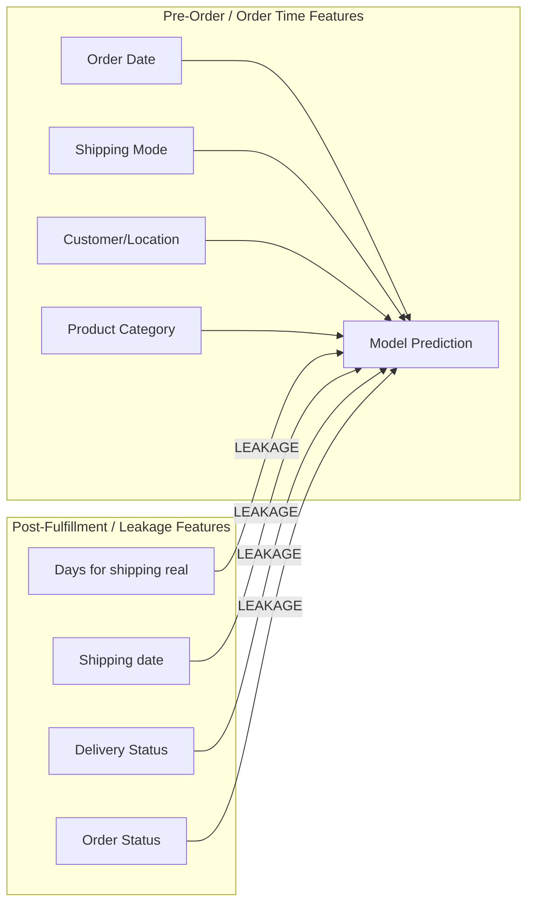

# Data & Modeling Pitfalls: Target Leakage, Overfitting & Structural Risks

This document details critical data hygiene risks, target leakage vectors, multicollinearity, high-cardinality overfitting pitfalls, and sampling biases identified in the **Smart Track / DataCo Supply Chain Dataset** using [`DescriptionDataCoSupplyChain.csv`](file:///d:/smart_track/DescriptionDataCoSupplyChain.csv) and empirical Python data checks on [`cleaned_data (1).csv`](file:///d:/smart_track/cleaned_data%20(1).csv).

---

## 1. Direct & Indirect Target Leakage Risks

Target leakage occurs when features containing information about the target variable—that would **not** be available at the time of prediction in production—are included during model training.



### Risk 1.1: `Delivery Status` $\leftrightarrow$ `Late_delivery_risk` (Perfect Target Leakage)
- **Empirical Check**:
  - `Delivery Status == 'Late delivery'` maps **100.0%** to `Late_delivery_risk == 1` (98,977 rows).
  - `Advance shipping` & `Shipping on time` map **100.0%** to `Late_delivery_risk == 0` (73,788 rows).
- **Pitfall**: If training a classifier to predict `Late_delivery_risk`, keeping `Delivery Status` in the feature set yields a trivial 100% accuracy model that fails completely in production.

### Risk 1.2: Post-Fulfillment Features in Logistics Delay Models
- **Post-Hoc Features**:
  - `Days for shipping (real)`: Actual transit duration (recorded *after* shipment arrives).
  - `shipping date (DateOrders)`: Dispatch timestamp (recorded *at shipping time*).
- **Pitfall**: If the business objective is to predict whether an order will be late **at the moment the customer places the order**, `Days for shipping (real)` and `shipping date (DateOrders)` are future information. Subtracting `order date` from `shipping date` directly computes shipping duration.
- **Remedy**: Drop `Days for shipping (real)` and `shipping date (DateOrders)` when training real-time order-placement prediction models.

### Risk 1.3: Mathematical Determinism in Financial Targets
- **Calculated Identities**:
  - `Sales per customer` $\equiv$ `Order Item Total` (Max difference = **0.0** across all 172,765 rows).
  - `Order Item Total` $\equiv$ `Sales` - `Order Item Discount`.
  - `Sales` $\equiv$ `Order Item Product Price` $\times$ `Order Item Quantity`.
  - `Order Item Profit Ratio` $\equiv$ $\frac{\text{Benefit per order}}{\text{Sales}}$.
- **Pitfall**: Attempting to predict `Sales per customer` while including `Order Item Total` (or vice versa), or predicting `Order Item Profit Ratio` while keeping `Benefit per order` results in 100% deterministic target leakage.

### Risk 1.4: Post-Hoc `Order Status` Leakage
- **Status Values**: `COMPLETE`, `PENDING_PAYMENT`, `PROCESSING`, `PENDING`, `CLOSED`, `ON_HOLD`, `PAYMENT_REVIEW`.
- **Pitfall**: `Order Status` is updated as order lifecycle events occur. Using `Order Status` to predict order profit, discount rate, or late shipping introduces post-fulfillment state leakage.

---

## 2. Group Leakage & Temporal Leakage

### Risk 2.1: Group Leakage Across Customer / Order IDs
- **Empirical Check**:
  - `Customer Id` and `Order Customer Id` are **100.0% identical columns**.
  - There are 20,261 unique customers/orders spanning 172,765 line items (avg ~8.5 line items per customer).
- **Pitfall**: Using standard random `train_test_split` (or standard K-Fold CV) will randomly distribute line items from the *same customer or order* across both training and validation folds. The model will memorize customer-specific attributes, yielding artificially inflated cross-validation scores that collapse on unseen customers (**Data Contamination / Group Leakage**).
- **Remedy**: Use `GroupKFold` or `GroupShuffleSplit` grouped on `Customer Id` / `Order Id`.

### Risk 2.2: Temporal Contamination (Future-to-Past Leakage)
- **Time Window**: `order date (DateOrders)` represents continuous temporal data.
- **Pitfall**: Standard random sampling shuffles future transactions into the training set and past transactions into the test set. Models learn future trends/seasonality to predict past events, overestimating model performance.
- **Remedy**: Implement strict **Chronological Split** (e.g., train on 2015–2017 data, test on 2018 data).

---

## 3. High Cardinality & Overfitting Risks

High-cardinality features can easily cause tree models (XGBoost, LightGBM, Random Forest) or neural networks to overfit on noise.

| Feature Name | Unique Count | Total Rows | Overfitting Mechanism & Severity |
| :--- | :---: | :---: | :--- |
| `Order Item Id` | **172,765** | 172,765 | **Extreme**: Primary key (100% unique). Tree algorithms will create splits on individual ID values, memorizing targets. **MUST DROP**. |
| `Customer Id` / `Order Customer Id` | **20,261** | 172,765 | **High**: Categorical ID treated as numerical will cause spurious ordinal splits. **MUST DROP OR TARGET-ENCODE WITH OOF**. |
| `Customer Street` | **7,435** | 172,765 | **High**: Extremely sparse text address. One-hot encoding creates 7,400+ binary features. |
| `Order City` | **3,585** | 172,765 | **Medium-High**: High cardinality city names. Leads to overfitting without frequency or hierarchical aggregation. |
| `Order State` | **1,089** | 172,765 | **Medium**: Regional granularity. Should be aggregated to `Order Region` or `Market`. |

---

## 4. Multicollinearity & Feature Duplication

Redundant features increase model complexity, degrade tree split interpretability, and break linear models.

```
Identified Duplications & Redundancies:
├── 1. Customer Id == Order Customer Id (100% Duplicate)
├── 2. Category Id == Product Category Id (100% Duplicate)
├── 3. Category Id <-> Category Name (ID vs Text String duplication)
├── 4. Department Id <-> Department Name (ID vs Text String duplication)
├── 5. Sales per customer == Order Item Total (100% Duplicate)
└── 6. order date (DateOrders) <-> Order_date <-> Order_Time (Redundant representations)
```

---

## 5. Sample Selection Bias (Pre-Filtering Hazard)

In the data cleaning notebook [`IOT cleaning.ipynb`](file:///d:/smart_track/IOT%20cleaning.ipynb):
- Orders with `Order Status == 'SUSPECTED_FRAUD'` and `Order Status == 'CANCELED'` were permanently removed from the dataset.

### Operational Impact
- **Selection Bias**: In real-world deployment, the production model will encounter fraud attempts and canceled orders.
- **Consequence**: Models trained exclusively on non-canceled, non-fraudulent orders will exhibit skewed baseline probabilities and fail to gracefully handle anomalous/canceled orders in real-time scoring.

---

## 6. Actionable Hygiene Checklist for Model Building

When training models on this dataset, enforce the following guidelines:

- [ ] **Drop Identifier Primary Keys**: Immediately drop `Order Item Id`, `Order Item Cardprod Id`, `Customer Email`, `Customer Password`.
- [ ] **Deduplicate Columns**: Drop `Order Customer Id`, `Product Category Id`, `Sales per customer`, `Order_date`, `Order_Time`.
- [ ] **Remove Target Leaks based on Task**:
  - *For `Late_delivery_risk` prediction*: Drop `Delivery Status`, `Days for shipping (real)`, `shipping date (DateOrders)`.
  - *For Financial/Profit prediction*: Drop `Order Item Profit Ratio`, `Order Item Total`, `Sales` (keep un-derived primitives).
- [ ] **Validation Strategy**: Use **GroupKFold** (grouped by `Customer Id`) combined with a **Chronological Split** by `order date`.
- [ ] **High Cardinality Handling**: Use Target Encoding with Out-Of-Fold (OOF) smoothing or frequency encoding for `Order City` and `Order State` instead of raw One-Hot Encoding.
