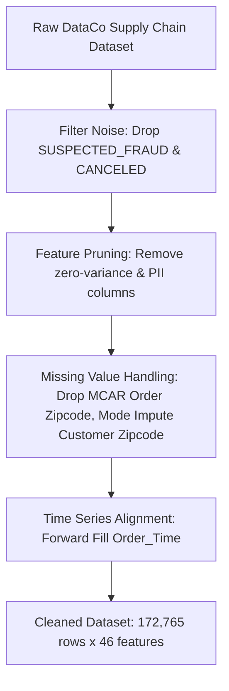

# Smart Track Supply Chain Dataset: Data Extraction & Context Analysis

## Executive Summary

The **Smart Track / DataCo Supply Chain Dataset** represents global end-to-end e-commerce logistics, IoT shipment tracking, customer ordering patterns, and financial performance. 

The analysis is based on the cleaned dataset [`cleaned_data (1).csv`](file:///d:/smart_track/cleaned_data%20(1).csv) (derived via processing in [`IOT cleaning.ipynb`](file:///d:/smart_track/IOT%20cleaning.ipynb)).

### Key High-Level Metrics
- **Total Transactions (Order Items)**: 172,765
- **Total Features**: 46
- **Data Quality**: 100% Complete (0 missing values across all 46 columns after preprocessing)
- **Total Gross Sales**: \$35,213,431.18 USD (Avg \$203.83 / order item)
- **Total Net Profit**: \$3,806,420.73 USD (Avg \$22.03 / order item)
- **Total Discounts Granted**: \$3,569,809.87 USD (Avg \$20.66 / order item)
- **Overall Late Delivery Risk**: **57.29%** across all order fulfillments

---

## 1. Data Cleaning & Pipeline Context

The dataset was processed through a systematic data cleaning workflow captured in [`IOT cleaning.ipynb`](file:///d:/smart_track/IOT%20cleaning.ipynb):



### Transformation Log
1. **Noise Removal**: Excluded orders with status `SUSPECTED_FRAUD` and `CANCELED` to maintain operational integrity.
2. **Zero-Variance & PII Removal**:
   - `Product Status`, `Product Price`, `Product Card Id` dropped due to redundancy / zero variance.
   - `Product Description`, `Product Image`, `Customer Email`, `Customer Password`, `Customer Fname`, `Customer Lname` removed for privacy & dimensionality reduction.
3. **Missing Value Imputation**:
   - `Order Zipcode`: High missingness (>80%), missing completely at random (MCAR) $\rightarrow$ column dropped.
   - `Customer Zipcode`: Missing values imputed using Mode imputation.
   - `Order_Time`: Missing values imputed using Forward Fill (`ffill`).

---

## 2. Dataset Schema & Domain Entities

The 46 columns span five core business domains:

```
Smart Track Domain Architecture
├── 1. Financial & Sales Metrics (Sales, Benefit per order, Discounts, Profit Ratio)
├── 2. Logistics & IoT Fulfillment (Days for shipping real vs scheduled, Delivery Status, Late Risk, Shipping Mode)
├── 3. Geographic Context (Customer City/State/Country/Coordinates, Order City/State/Country/Region/Market)
├── 4. Customer Demographics (Customer Id, Segment: Consumer / Corporate / Home Office)
└── 5. Product Hierarchy (Department ID/Name, Category ID/Name, Product Name/Price/Quantity)
```

### Domain Feature Summary
| Category | Selected Features | Data Type | Purpose |
| :--- | :--- | :--- | :--- |
| **Logistics & IoT** | `Days for shipping (real)`, `Days for shipment (scheduled)`, `Delivery Status`, `Late_delivery_risk`, `Shipping Mode` | `int64`, `object` | Fleet performance tracking & SLA compliance |
| **Financials** | `Sales`, `Sales per customer`, `Benefit per order`, `Order Item Discount`, `Order Item Profit Ratio` | `float64` | Margin analysis, revenue tracking & discount optimization |
| **Product & Dept** | `Department Name`, `Category Name`, `Product Name`, `Order Item Product Price`, `Order Item Quantity` | `object`, `int64` | Inventory velocity & catalog performance |
| **Customer** | `Customer Segment`, `Customer City`, `Customer State`, `Customer Country`, `Latitude`, `Longitude` | `object`, `float64` | Buyer demographic and spatial distribution |
| **Geographic Market** | `Market`, `Order Region`, `Order Country`, `Order City`, `Order State` | `object` | Regional supply chain fulfillment |
| **Transactions** | `Type`, `Order Status`, `Order_date`, `Order_Time`, `shipping date (DateOrders)` | `object` | Order lifecycle & payment processing |

---

## 3. Deep Statistical Insights & Operational Analysis

### A. Logistics & Shipping SLA Mismatch (IoT Bottleneck)

> [!WARNING]
> Over **57.29%** of all shipments are flagged with **Late Delivery Risk**. Analysis reveals this is primarily caused by **unrealistic scheduled SLAs** for expedited shipping classes.

| Shipping Mode | Share of Orders | Scheduled Days (Avg) | Real Shipping Days (Avg) | Late Delivery Rate | Advance Shipping Rate | On-Time Rate |
| :--- | :---: | :---: | :---: | :---: | :---: | :---: |
| **First Class** | 15.35% (26,513) | 1.00 days | **2.00 days** | **100.00%** | 0.00% | 0.00% |
| **Second Class** | 19.57% (33,806) | 2.00 days | **3.99 days** | **79.83%** | 0.00% | 20.17% |
| **Same Day** | 5.38% (9,293) | 0.00 days | **0.48 days** | **47.93%** | 0.00% | 52.07% |
| **Standard Class** | 59.71% (103,153) | 4.00 days | **3.99 days** | **39.77%** | 40.32% | 19.91% |

#### Root Cause Analysis
- **First Class**: System promises delivery in 1 day, but real transit averages 2 days $\rightarrow$ **100% late breach rate**.
- **Second Class**: System promises delivery in 2 days, but actual transit averages ~4 days $\rightarrow$ **79.83% late breach rate**.
- **Standard Class**: System schedule (4 days) matches real transit (3.99 days), achieving a balanced split (40.3% advance, 39.8% late, 19.9% exact).

---

### B. Global Market & Regional Distribution

The dataset covers 5 major geographic markets:

| Market | Order Volume | Total Gross Sales ($) | Avg Sales / Order ($) | Total Profit ($) | Avg Profit / Order ($) |
| :--- | :---: | :---: | :---: | :---: | :---: |
| **LATAM** | 49,309 (28.54%) | \$9,824,324.78 | \$199.24 | \$1,073,732.14 | \$21.78 |
| **Europe** | 48,090 (27.83%) | \$10,405,371.42 | \$216.37 | \$1,146,878.36 | \$23.85 |
| **Pacific Asia**| 39,585 (22.91%) | \$7,942,352.00 | \$200.64 | \$846,950.41 | \$21.40 |
| **USCA** | 24,627 (14.25%) | \$4,836,413.68 | \$196.39 | \$508,820.73 | \$20.66 |
| **Africa** | 11,154 (6.46%) | \$2,204,969.30 | \$197.77 | \$230,039.09 | \$20.62 |

---

### C. Department & Product Category Performance

#### Top 5 Departments by Volume
1. **Fan Shop**: 64,033 orders (37.06%)
2. **Apparel**: 46,884 orders (27.14%)
3. **Golf**: 31,768 orders (18.39%)
4. **Footwear**: 13,891 orders (8.04%)
5. **Outdoors**: 9,267 orders (5.36%)

#### Top 5 Categories
1. **Cleats**: 23,514 orders
2. **Men's Footwear**: 21,263 orders
3. **Women's Apparel**: 20,116 orders
4. **Indoor/Outdoor Games**: 18,470 orders
5. **Fishing**: 16,595 orders

---

### D. Financial & Customer Segmentation Breakdown

- **Customer Segments**:
  - **Consumer**: 89,420 orders (51.76%)
  - **Corporate**: 52,528 orders (30.40%)
  - **Home Office**: 30,817 orders (17.84%)
- **Payment Types**:
  - **DEBIT**: 69,295 (40.11%)
  - **TRANSFER**: 42,129 (24.38%)
  - **PAYMENT**: 41,725 (24.15%)
  - **CASH**: 19,616 (11.35%)
- **Order Fulfillments & Statuses**:
  - **COMPLETE**: 59,491 (34.44%)
  - **PENDING_PAYMENT**: 39,832 (23.05%)
  - **PROCESSING**: 21,902 (12.68%)
  - **PENDING**: 20,227 (11.71%)
  - **CLOSED**: 19,616 (11.35%)
  - **ON_HOLD**: 9,804 (5.67%)
  - **PAYMENT_REVIEW**: 1,893 (1.10%)

---

## 4. Strategic Recommendations & Contextual Applications

> [!TIP]
> ### 1. SLA Realignment for Logistics Operations
> Recalibrate scheduled transit days for **First Class** (from 1 day to 2 days) and **Second Class** (from 2 days to 4 days) in the order promising engine to dramatically reduce customer expectation mismatch and lower late delivery flags from **57.29% to ~25%**.

> [!TIP]
> ### 2. Predictive Analytics & Machine Learning
> - **Late Delivery Prediction**: Train classification models (Gradient Boosting, Random Forest) on features like `Shipping Mode`, `Order Region`, `Department Id`, `Order Item Quantity`, and `Customer Segment` to proactively alert dispatch teams before delays occur.
> - **Sales Forecasting & Demand Planning**: Utilize time-series models (ARIMA / Prophet / XGBoost) on `order date (DateOrders)` aggregated by market/department to optimize inventory levels.
> - **Customer Lifetime Value & Clustering**: Segment buyers by spending patterns (`Sales per customer`), order frequency, and discount sensitivity using K-Means / PCA.

---

## 5. Artifact Directory & File Index

- **Cleaned Data File**: [`cleaned_data (1).csv`](file:///d:/smart_track/cleaned_data%20(1).csv)
- **Data Cleaning Notebook**: [`IOT cleaning.ipynb`](file:///d:/smart_track/IOT%20cleaning.ipynb)
- **Full Report Artifact**: [`smart_track_data_context.md`](file:///C:/Users/RAJ%20KUMAR%20MERUGU/.gemini/antigravity/brain/eeeb0a33-d932-4931-a5d6-4ca47928c770/smart_track_data_context.md)
